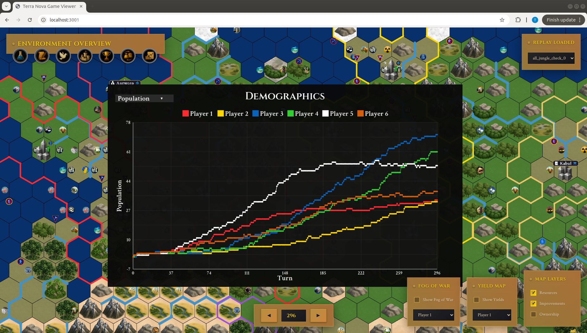
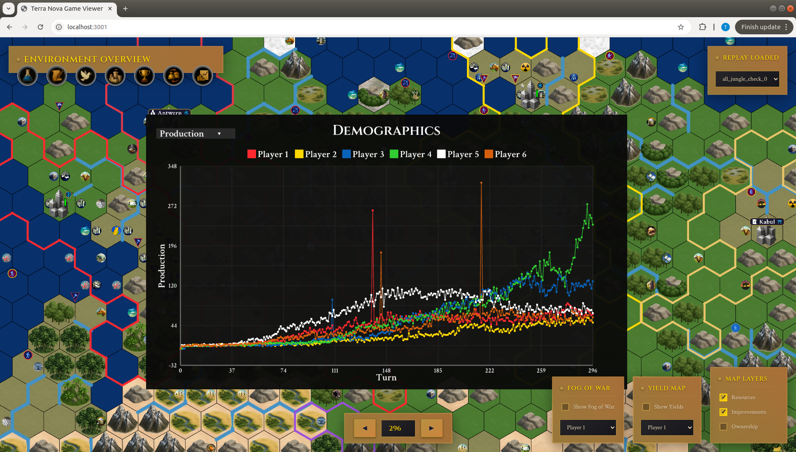

<p align="center">
  
</p>

<p align="center">
  
</p>

Terra Nova is a comprehensive challenge environment for reinforcement learning research inspired by Civilization V.

## Table of Contents
- [Installation](#installation)
- [Quickstart](#quickstart)
- [Maps](#maps)
- [Documentation](#documentation)
- [Recording Games](#recording-games)
- [Replay Viewer](#replay-viewer)

## Installation
We provide a short requirements file that will auto-install all prerequisites using your preferred package manager.

Terra Nova is compatible with both older and newer combinations of Python and JAX. 

We've tested Terra Nova with the following combinations:
- Python 3.9.18 + JAX 0.4.30 
- Python 3.13.9 + JAX 0.8.0

For example, with `mamba`:
```bash
mamba create -n terra_nova python=3.9.18
mamba activate terra_nova
pip install -r requirements.txt
```

or

```bash
mamba create -n terra_nova python=3.13.9
mamba activate terra_nova
pip install -r requirements_311.txt
```

## Quickstart
Terra Nova comes with utilities to automatically distribute environments across an arbitrary mesh of GPUs, allowing for increased throughput via horizontal scaling.

We also provide a draft neural network and FIFO buffer. 

To ensure your machine is running Terra Nova properly, perform the following steps:

(1) Clone this repo and install the software prerequisites under [Installation](#installation).

(2) Download the 10k procedurally generated maps:
```bash
git clone https://huggingface.co/datasets/trevormcinroe/terra_nova_maps
```

(3) Make a folder for testing and copy a few maps into the folder:
```bash
mkdir ./terra_nova_testing
cp ./terra_nove_maps/initial_release/100000_turn0.gamestate ./terra_nova_testing
cp ./terra_nove_maps/initial_release/100001_turn0.gamestate ./terra_nova_testing
cp ./terra_nove_maps/initial_release/100002_turn0.gamestate ./terra_nova_testing
```

(4) Run the demo training script (replace `CUDA_VISIBLE_DEVICES=3,4` with your preferred XLA device arrangement):
```bash
CUDA_VISIBLE_DEVICES=3,4 python3 training_demo.py --seed 0 --num_steps 300 --map_folder ./terra_nova_testing/ --distributed_strategy duplicate  --memory_length 7
```

## Maps
Terra Nova games take place on procedurally-generated maps. We provide 10k maps you can download [here](https://huggingface.co/datasets/trevormcinroe/terra_nova_maps).
For more information on map contents and mechanics, see [here](https://trevormcinroe.github.io/terra_nova_environment#maps-mech).

We also provide utilities for generating your own maps, which can be read about [here](https://trevormcinroe.github.io/terra_nova_documentation#mapgen).


## Documentation
For documentation on environment mechanics, see [here](https://trevormcinroe.github.io/terra_nova_environment).

For documentation on the environment API, the action space, the observation space, and more, see [here](https://trevormcinroe.github.io/terra_nova_documentation).

## Recording Games
We highly recommend using CPU-only context for recording Terra Nova games. This is because the recorder captures the entirety of the gamestate on every played turn, which requires a significant amount of memory. 

You can accomplish this by using the following preamble:

```bash
CUDA_VISIBLE_DEVICES= python3 your_recording_script.py
```

NOTE: newer versions of jax may require the additional preamble `JAX_PLATFORMS=cpu`. 

## Replay Viewer
After a game has been recorded, you can watch the recording in your browser of choice. We recommend Chrome.

The Viewer uses node, which can be installed on Linux systems like:

```bash
sudo apt install nodejs
```

The Viewer allows the user to see the entire game map and every agent's units, cities, technologies, and more.

The Viewer also provides plots of various metrics over the course of the game:

<p align="center">
  
</p>
<p align="center">
  
</p>
<p align="center">
  
</p>
